```{r message = FALSE, warning = FALSE, echo=FALSE}
def.chunk.hook  <- knitr::knit_hooks$get("chunk")
knitr::knit_hooks$set(chunk = function(x, options) {
  x <- def.chunk.hook(x, options)
  ifelse(options$size != "normalsize", paste0("\\", options$size,"\n\n", x, "\n\n \\normalsize"), x)
})
knitr::opts_chunk$set(warning=FALSE, message=FALSE, size = "tiny")
```

# Introduction

## MPD Murder of George Floyd

- highly publicized police murder of Mr. George Floyd on May 25th, 2020
  - in part catalyzed the growing #Blacklivesmatter movement
  - sparked sustained protests locally and around the world
- Much talk about increases in homicide and gun violence in this period (Star Tribune)
- This event and ensuing unrest led us to consider...
  - What does the timing look like (e.g., when did increases happen?)
  - What explains these increases?
  - What else has an event of this magnitude impacted (e.g., health?)
    - to what extent has it done so in an unequal fashion?

## Broad Research Questions

- What has been the public health impact of this police murder?
  - firearm assault injury incidence?
  - mental health diagnoses?
  - differentially based on race and space?
- How does police violence generally impact public health?
  - how is police violence shaped by legacies of structural racism?
  
## Roadmap

- **Part 1**: The Effects of The Police Murder on Public Health
  - firearm assault injury (Larson et al. 2023)
  - mental health hospital incidence (Santaularia et al. *under review*)
- **Part 2**: Historical Structural Racism, Police Shootings, and Health
  - new, fresh proposed research
- **Part 3**: Strategies of Resilience and Racial Healing in Minneapolis
- **Part 4**: Questions and Discussion
  - *what ideas do you have to inform our continued research*
  - *what questions should we be asking?*

# Tracing the Public Health Consequences: Work Completed

## Literature Review: Gun Injury

- Why would we expect an uptick in gun injury after the murder?
  - pandemic explanation 
    - weakening of social bonds, heightened visibilities of existing vulnerabilities (Wrigley-Field et al. 2020)
  - depolicing explanation (Shjarback et al. 2017)
  - augmentation of legal estrangement (Bell 2017)
    - bolstering feelings of distrust in legal institutions and feelings of structural social exclusion
  
## Literature Review: Mental Health Diagnoses

- mental health effects of *exposure* to police violence 
  - general anxiety and depression (Geller et al. 2014; Alang et al. 2021)
  - suicide attempts (DeVylder 2017)
  - anticipation of future police violence (Salas-Hernandez et a. 2022)
- general health effects extend beyond direct exposure (DeVylder et al. 2022; Haile et al. 2023)
- exposure to police killing associated with .14 additional poor mental health days per months for Black individuals (Venkataramani et al. 2018)
  - no increase for White individuals 


## Research Questions

- Did firearm assault injuries increase after the police murder of Mr. Floyd?
  - if so, was there spatial variation in this increase?
  - if so, does pandemic policy or changes in policing explain the increase?
- Did mental health diagnoses increase after the police murder of Mr. Floyd?
  - if so, amongst which racial groups?
  - if so, where was there spatial variation in the increase?

## Data

- Outcome Variables (Minnesota Hospital Association Data)
  - firearm assault injury rate per 100,000
  - mental health diagnoses per 1,000
- Focal Predictor Variables
  - time trend, event indicator, post-event time trend
- Time Varying Controls
  - pandemic policy (stay at home, state of emergency)
  - weather (MN DNR)
  - amount of darkness before 12am (`suncalc` in R)
  - proportion school days (Minneapolis Public Schools)
  - MPD Use of Force (lag)
  - MPD Stops (lag)
  - MPD Officer Involved Shootings (lag)
  - Median Household Income
  - Percent Black
  - concentrated disadvantage
  

## Design: Interrupted Time Series

$y_t =\beta_0+\beta_1 Time_t + \theta Event_t + \beta_2 TimePost_t+ \mathbf{\phi X}_t+\rho_1 y_{t-1}+\rho_2 y_{t-2}+\rho_3 y_{t-3}+\epsilon_t$


## Firearm Assault Injury Incidence: City-Wide Changes

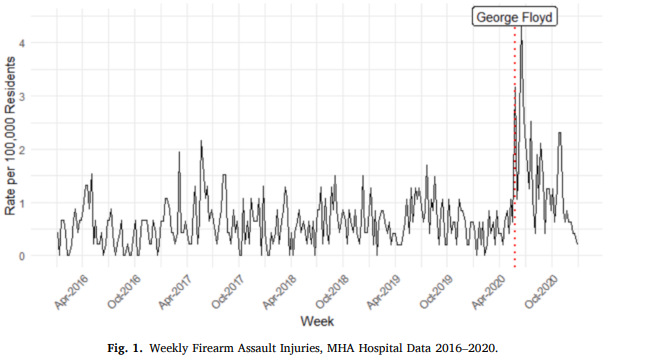

## Firearm Assault Injury Incidence: ZCTA-Specific Changes

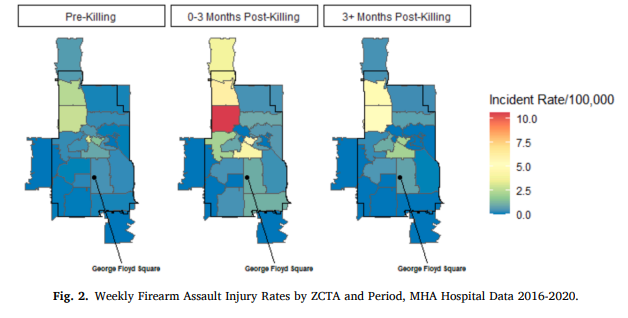

## Firearm Assault Injury Incidence: ITS AR(1) Models

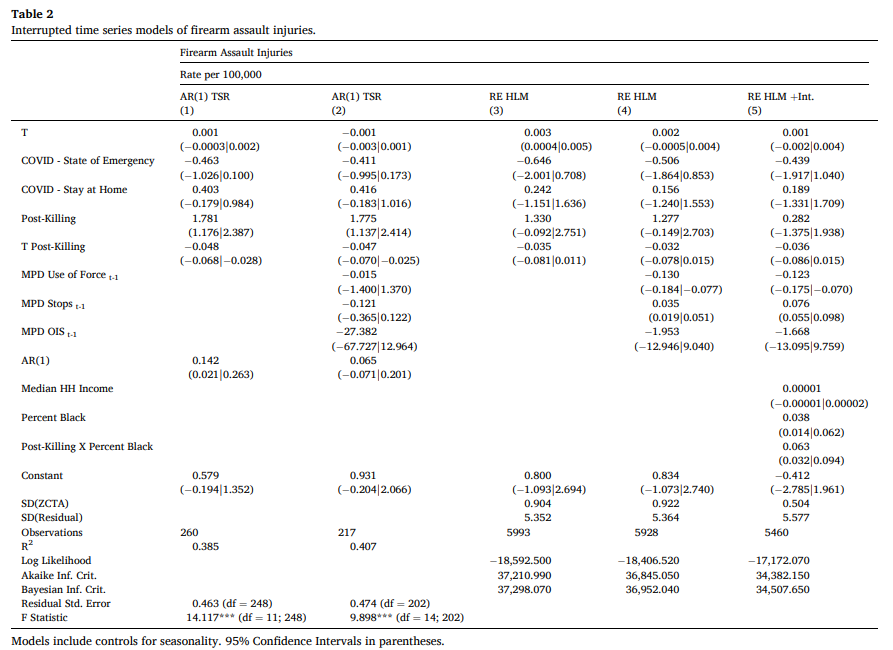

## Firearm Assault Injury Incidence: Interaction Plot

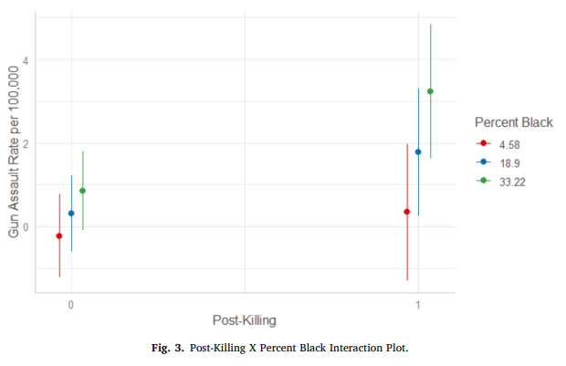

## Mental Health Incidence: City-Wide Changes

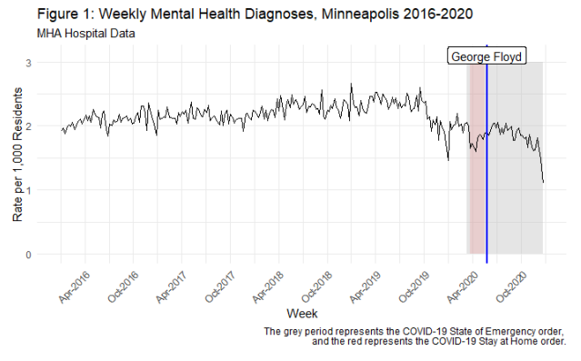

## Mental Health Incidence: City-Wide Changes by Race

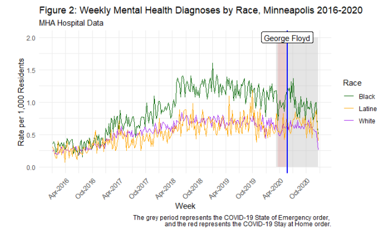

## Mental Health Incidence: ITS AR(3) Models

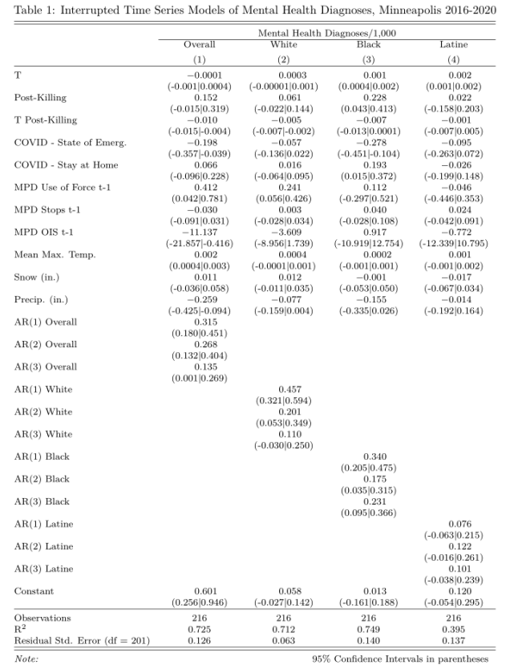{height=90%}

## Mental Health Incidence: Spatial Variation

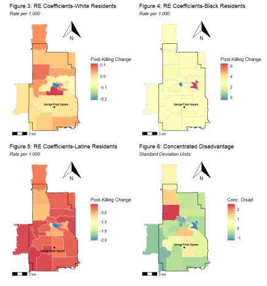{height=70%}

## Conclusions

- the police murder of Mr. Floyd
  - increased firearm assault injury incidence
    - larger increases in ZCTAs with higher percent Black population
    - increase not explained by COVID-19 policy or "depolicing"
  - increased mental health diagnoses in Minneapolis
    - increase concentrated amongst Black residents
    - increase was global for Black residents (increase for White residents in areas of higher concentrated disadvantage)

# Structural Racism, Police Violence, and Health: Work Ahead

## Introduction: Police Violence

- police shootings
  - In 2023 (thus far...), 915 people fatally shot by police (Mapping Police Violence 2023)
  - unarmed Black person about 3.5x more likely to be shot that an unarmed White person (Ross 2015)
  - lifetime risk of being killed by police 1 in 1,000 for Black men (Edwards et al. 2018)
    - ~2.5 higher risk as compared White men
  - racial disparities as well in use of force generally (Knox et al. 2020)
  
## Introduction: Structural Racism and Police Violence

- historical practices of structural racial exclusion
  - redlining ("HOLC Grades")
    - ranged from "A" to "D" and process of assignment highly racialized (Faber 2020)
    - effectively conflated race and "financial risk" 
  - racial covenants
    - clauses inserted into property deeds to prevent non-White individuals from owning or renting space
- Individuals in lower HOLC graded areas experience worse contemporary health outcomes
  - physical and mental health (Lynch et al. 2021), life expectancy (Graetz et al. 2022), etc.
- redlined spaces linked to higher incidence of fatal encounters with police (Mitchell and Chiahay 2022)
  
## Introduction: Police Violence and Health

- direct health related concerns (e.g., morality, injury)
- health effects of *exposure* to police violence 
  - general anxiety and depression (Geller et al. 2014; Alang et al. 2021)
  - suicide attempts (DeVylder 2017)
  - anticipation of future police violence (Salas-Hernandez et a. 2022)
- general health effects extend beyond direct exposure (DeVylder et al. 2022; Haile et al. 2023)

## Research Questions

- **RQ1**: What's impact of historical redlining and racial covenants on police shootings?
  - net of current homicide rates and other factors
- **RQ2**: What's the impact of police shootings on health?
  - firearm assault injury, mental health, substance use, suicide, etc.
- **RQ3**: Do police shootings mediate the relationship between structural racism and health outcomes?
- **RQ4**: What are the mechanisms by which police shootings effect health outcomes? What are strategies of resilience used by community members and how do these strategies shape these processes?

## Theoretical Model

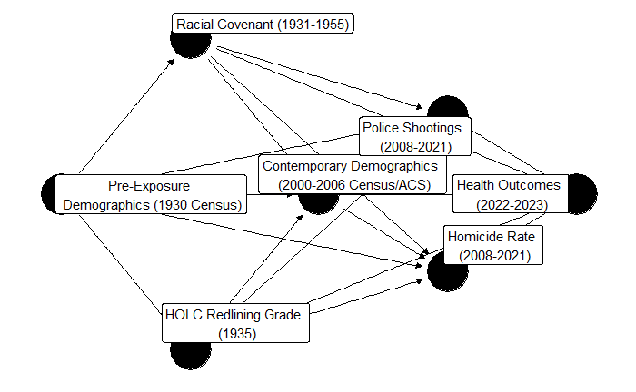{height=85%, width=85%}

## Data: Quantitative

- Key Exposures (Mapping Prejudice Project)
  - presence of redlining in ZCTA 
  - presence of racial covenants in ZCTA
- Key Outcomes (Minnesota Hospital Association Data)
  - health diagnoses per 1,000
- Key Mediator (OpenMinneapolis)
  - rate of police shootings
- Controls
  - Pre-Exposure demographics and economic structure (1930 Census Data)
  - contemporary demographics and economic structure (2000-2006 Census Data)

## Redlining in Minneapolis and St. Paul

```{r, warning=FALSE, message=FALSE, include=FALSE}
library(tigris)
library(tidycensus)
library(sf)
library(tidyverse)

mpls_stp <- places(state = "MN") %>%
  filter(NAME=="Minneapolis" | NAME=="St. Paul") %>%
  st_union() 

mn_tracts <- tracts(state = "MN") %>%
  st_filter(mpls_stp) %>%
  st_set_crs(st_crs(mpls_stp)) %>%
  st_intersection(mpls_stp)


holc <- st_read("SRPH Grant/Census_HOLC_Research-main/Census_HOLC_Research-main/2020_Census_Tracts/Tracts_2020_HOLC/Tracts_2020_HOLC/Tracts_2020_HOLC.shp") %>%
  filter(MAX_city=="Minneapolis"|MAX_city=="St. Paul") %>%
  st_transform(st_crs(mn_tracts)) %>%
  st_intersection(mpls_stp)

ramsey_rc <- st_read("C:/Users/rlarson21/Documents/Research/Gun-Violence-MN/SRPH Grant/mp-us-racial-covenants-main/mp-us-racial-covenants-main/mn-ramsey-county/covenants-mn-ramsey-county/covenants-mn-ramsey-county.shp") %>%
  st_transform(st_crs(mpls_stp)) %>%
  st_intersection(mpls_stp) %>%
  mutate(workflow = as.character(workflow),
         geocd_dist = as.numeric(geocd_dist),
         manual_cx = as.character(manual_cx))

hennepin_rc <- st_read("C:/Users/rlarson21/Documents/Research/Gun-Violence-MN/SRPH Grant/mp-us-racial-covenants-main/mp-us-racial-covenants-main/mn-hennepin-county/covenants-mn-hennepin-county/covenants-mn-hennepin-county.shp") %>%
  st_transform(st_crs(mpls_stp)) %>%
  st_intersection(mpls_stp) %>%
  mutate(db_id = as.numeric(db_id),
         deed_date = as.Date(deed_date),
         dt_updated = as.Date(dt_updated),
         zn_subj_id = as.numeric(zn_subj_id),
         zn_dt_ret = as.Date(zn_dt_ret),
         med_score = as.numeric(med_score),
         plat_dbid = as.numeric(plat_dbid))

rc <- bind_rows(ramsey_rc, hennepin_rc)
```

```{r, warning=FALSE, message=FALSE, echo=FALSE}
ggplot()+
  geom_sf(data = mn_tracts, aes(geometry=geometry),
          alpha=0)+
  geom_sf(data = holc, aes(geometry=geometry,
                          fill = FIRST_holc))+
  scale_fill_manual(values = c("darkgreen", "blue","yellow","red"))+
  labs(title = "HOLC Redlining Grades in MSP, 1935", 
       subtitle = "Mapping Inequality, University of Richmond",
       fill = "HOLC Grade")+
   theme(axis.text.x = element_blank(),
        axis.text.y = element_blank(),
  axis.line = element_blank(),
  axis.ticks = element_blank(),
  panel.border = element_blank(),
  panel.grid = element_blank(),
  axis.title = element_blank(),
  panel.background = element_blank(),
  panel.grid.major = element_line(colour="transparent"), 
  plot.subtitle = element_text(face="italic"),
  strip.background = element_rect(fill = "white", 
                colour = "black"))+
  ggspatial::annotation_scale()+
  ggspatial::annotation_north_arrow(which_north = "true",
                                    location = "tr")

```

## Racial Covenants in Minneapolis and St. Paul

```{r, echo=FALSE}
ggplot()+
  geom_sf(data = mn_tracts, aes(geometry=geometry),
          alpha=0)+
  geom_sf(data = rc, aes(geometry=geometry, color = deed_year))+
  labs(title = "Racial Covenants in  MSP, 1910-1961", 
       subtitle = "Mapping Prejudice Project, UMN",
       color = "Deed Year")+
   viridis::scale_color_viridis()+
   theme(axis.text.x = element_blank(),
        axis.text.y = element_blank(),
  axis.line = element_blank(),
  axis.ticks = element_blank(),
  panel.border = element_blank(),
  panel.grid = element_blank(),
  axis.title = element_blank(),
  panel.background = element_blank(),
  panel.grid.major = element_line(colour="transparent"), 
  plot.subtitle = element_text(face="italic"),
  strip.background = element_rect(fill = "white", 
                colour = "black"))+
  ggspatial::annotation_scale()+
  ggspatial::annotation_north_arrow(which_north = "true",
                                    location = "tr")
```

## Mixed Method Design: Quantitative

- modeling the relationship between historical exposure to redlining/racial covenants and contemporary police shootings
  - spatial lag autocorrelation (AR) models adjusting for historical demographics
- modeling the relationship between police shootings and health outcomes
  - two-way fixed effects (TWFE) model on panel data from 2008-2023
- modeling the relationship between historical exposure to redlining/racial covenants and health outcomes
  - testing for a mediation effect of police shootings using a counterfactual mediation approach (Graetz et al. 2022)

## Mixed Method Design: Qualitative

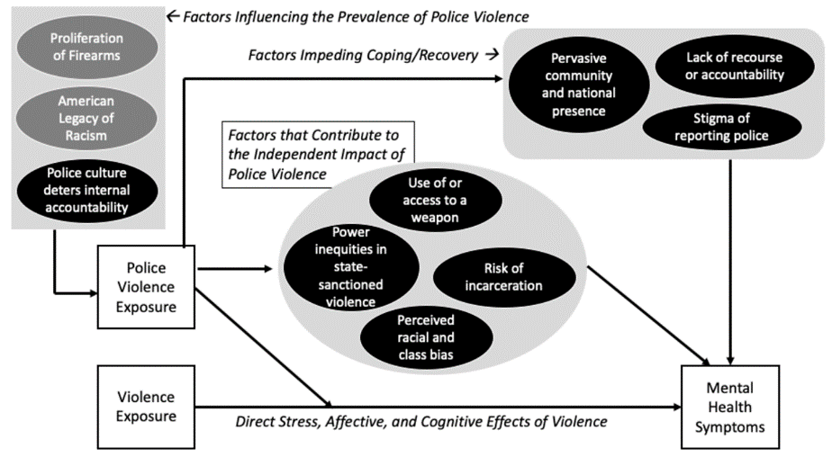

## Background: Policing, Health, & Resilience

- Resilience refers to the ability -- through positive emotions, successful traits, or coping behaviors  --  to respond to stressful or traumatic situations in healthy or positive ways (Sims-Schouten and Gilbert 2022; Suslovic and Lett 2023). 
 - Resilience often places the emphasis on individual adaptation to harm than the adaptation of the systems that cause harm.
- Police Violence-related coping strategies: the Talk (Malone Gonzalez 2022), hypervigilance (Hawkins 2022), and  police avoidance (i.e., staying inside) (Smith and Robinson 2019).

## Holistic Trauma Framework

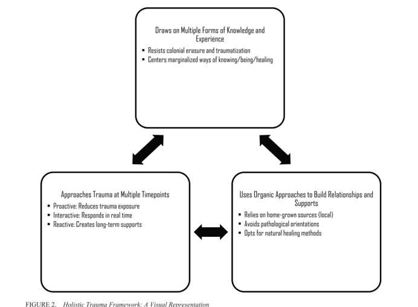

## Qualitative Research Questions

- How do police shootings shape residents’ perceptions of their individual and community health? 

- How do strategies of resilience used by community members shape these processes?

## Methods: Resident Interviews

- Conduct 40 semi-structured interviews with adult residents of Minneapolis-Saint Paul zip codes that have experienced a recent (2015-present) police shooting. 
  - Each interview will last approximately 60-90 minute.
  - In-person and recorded
  - Goal: to identify potential mechanisms, including police shooting-induced stress perceptions, coping behaviors, and resiliency, that link exposure to police shootings to residents’ health outcomes.
  
## Focus Group Insights Inform Resident Interview Questions

- Conduct 3 focus group with 18 residents of impacted Minneapolis-Saint Paul zip codes 
  - Prioritize residents from historically redlined areas. 
  - Goal: to obtain residents’ feedback on proposed interview questions, identify additional areas and types of inquiry, and discuss potential policy solutions
- Participant Recruitment
  - Work with local health organizations (i.e., community health clinics and hospitals) to recruit focus group and study participants from their adult client population. 
  - Mail study invitations to eligible zip code addresses and screening responding individuals for eligibility. 
  
## Sample Resident Interview Questions

- How do you think that policing impacts your health?
- How do you generally hear about a police shootings of an unarmed person? 
  - Do you usually discuss the incident with someone else? Who?
- What emotions do you generally feel after hearing about a police shooting of an unarmed person? 
  - What do you do to manage those emotions?
    - Have you ever sought therapy after hearing about a police killing? 
  - How does your daily routine change, if at all? 
    - Do you tend to go to work or school the next day? 
    - Do you avoid certain areas or activities?
- How do your family/friends/neighbors seem to respond in the days following a high-profile police shooting?

## Analyzing Residents' Interview Transcripts

- Flexible coding approach (Deterding and Waters 2018)
  - Coding participant interview transcripts for descriptive and basic conceptual categories.
  - Drafting analytical memos that highlight common themes and identify patterns across participants by demographics (i.e., class position, age, parental status).
  - Re-coding the interviews as we encounter new insights from existing literature and participant interviews.
  - Discussing major themes as a research team and drafting final analytical memos.
  
## Deliverables

- research manuscript
- grant proposal
- policy report

# Racial Healing in Minneapolis

## Racial Healing in Minneapolis

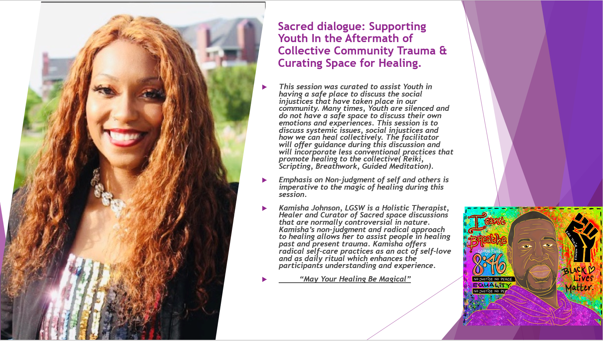

## Racial Healing in Minneapolis

- [Black Twin Citians finding comfort in safe spaces (startribune.com)](https://video.startribune.com/black-twin-citians-finding-comfort-in-safe-spaces/600045912/)

# Discussion

## Discussion

- Thank you for attending our breakout session!
- Very much looking forward to hearing your ideas about where to take our work

- Contact Information
  - Dr. Ryan Larson: rlarson21@hamline.edu
  - Chris Robertson: robe1930@umn.edu
  - Kamisha Johnson, LGSW: kamisha.johnson@gmail.com

